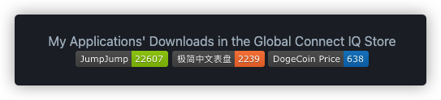

# Garmin Connect IQ Store Downloads Action
[![Contributors][contributors-shield]][contributors-url]
[![Forks][forks-shield]][forks-url]
[![Stargazers][stars-shield]][stars-url]
[![Issues][issues-shield]][issues-url]
[![MIT License][license-shield]][license-url]


<!-- PROJECT LOGO -->
<br />

<p align="center">
  <a href="https://github.com/Likenttt/garmin_ciq_downloads_badge_action">
    
  </a>
</p>


  <h3 align="center">Garmin Connect IQ Store Downloads Action</h3>

  <p align="center">
    Show awesome badges with the CIQ Store downloads in your projects!
    <br />
    <a href="https://github.com/Likenttt/garmin_ciq_downloads_badge_action"><strong>Explore the docs »</strong></a>
    <br />
    <br />
    <a href="https://github.com/Likenttt/DogecoinToTheMoon">View Demo</a>
    ·
    <a href="https://github.com/Likenttt/garmin_ciq_downloads_badge_action/issues">Report Bug</a>
    ·
    <a href="https://github.com/Likenttt/garmin_ciq_downloads_badge_action/issues">Request Feature</a>
  </p>


</p>


<!-- TABLE OF CONTENTS -->
<details open="open">
  <summary>Table of Contents</summary>
  <ol>
    <li>
      <a href="#about-the-action">About The Action</a>
      <ul>
        <li><a href="#built-with">Built With</a></li>
      </ul>
    </li>
    <li>
      <a href="#getting-started">Getting Started</a>
      <ul>
        <li><a href="#set-a-placeholder-in-your-doc">Set a placeholder in your doc</a></li>
        <li><a href="#involve-the-script">Involve the script</a></li>
        <li><a href="#make-some-modifications-in-the-workflow">Make some modifications in the workflow</a>
        <ul>
          <li><a href="#procedures">Procedures</a></li>
          <li><a href="#a-demo-yml">A demo yml</a></li>
          </ul>
        </li>
        <li><a href="#trigger-this-action">Trigger this action</a>
        <ul>
          <li><a href="#local-test">Local Test</a></li>
          <li><a href="#run-after-per-push">Run after per push</a></li>
          <li><a href="#run-on-schedule">Run on schedule</a></li>
          </ul>
        </li>
      </ul>
    </li>
    <li><a href="#contributing">Contributing</a></li>
    <li><a href="#license">License</a></li>
    <li><a href="#contact">Contact</a></li>
    <li><a href="#acknowledgements">Acknowledgements</a></li>
  </ol>
</details>


<!-- ABOUT THE PROJECT -->
## About The Action

<p align="center">
  <a href="https://github.com/Likenttt/Likenttt">
    
  </a>
  <a href="https://github.com/Likenttt/DogecoinToTheMoon">
    
  </a>
</p>

Sometimes I want to show the downloads of my Connect IQ application in its repo on Github. However there isn't any solution existed. 

In this action, I will demonstrate how to display a badge or badges  in a `README.md` , even any other documents that allow an html `img` label.

When it comes to the core implementation, this action use a python script to request the page from Garmin Connect IQ Store and search the downloads number with a regular expression. Eventually, the downloads in the exibition place(eg. README.md) will be replaced. The workflow will run on schedule as you willings, for me, it is 00:01 UTC per day.

A list of commonly used resources that I find helpful or code I used as an reference are listed in the acknowledgements.

### Built With

 After a technical research, two plans are in front of me,both of which use  [Shields.io](https://shields.io/) to generate a badge.
- [Cloudfare workers](https://workers.cloudflare.com/). As described on the homepage, Cloudfare allows users to deploy serverless code instantly across the globe to give it exceptional performance, reliability, and scale. It would be fast but every free worker has a limited run times, which  may be overused and make it not convinient to share with too many Github users.
- [Github Actions](https://github.com/features/actions). GitHub Actions makes it easy to automate all your software workflows, now with world-class CI/CD. Build, test, and deploy your code right from GitHub. Make code reviews, branch management, and issue triaging work the way you want. Well that‘s it.


<!-- GETTING STARTED -->
## Getting Started

Let's start.

### Set a placeholder in your doc

The python script that we will involve later need a string to replace, so I use a pre-set placeholder like `CIQ_Store_downloads-638-green`.

In a README.md or any documents that supports the html img label and you want to put a badge in, add this line.
```html

```

Follow instructions by  [Shields.io](https://shields.io/) , modify the string `CIQ_Store_downloads-638-green` according to your awesome idea. `_` means space and `-` is a separator of different parts for a badge.The most important is the number `638`, actually you can use any number between `0-9999999999`,  which will be replace later with the correct downloads number.

### Involve the script

1. Clone this repo
   ```sh
   git clone https://github.com/Likenttt/garmin_ciq_downloads_badge_action.git
   ```

2. Put `requirements.txt` and `queryDownloads.py` into the home directory of your repo.

3. Put the action workflow `garmin_download_count.yml` into `.github/workflows/`. If the directory is empty, just create it.

### Make some modifications in the workflow

#### Procedures

1. Specify the filename that you put the badge in with `readme_file_name` environment variable.
2. Specify the app's url id of the app to be calculated with `ciq_id` environment variable. You can find a `ciq_id` from the apps share link,eg. https://apps.garmin.com/zh-CN/apps/c6168ee2-aa5b-42d3-964d-7a891fb8fc12
3. Specify the display pattern you wrote in the doc with `badge_pattern` environment variable. Remeber to replace the number with `{}`.
4. Modify the commit action info.

#### A demo yml

```yaml
name: Get Garmin Downloads

# Controls when the workflow will run
on:
  schedule:
    - cron: '1 0 * * *'
env:
  readme_file_name: 'README.md'
  ciq_id: 'c6168ee2-aa5b-42d3-964d-7a891fb8fc12'
  badge_pattern: 'CIQ_Store_downloads-{}-green'

# A workflow run is made up of one or more jobs that can run sequentially or in parallel
jobs:
  # This workflow contains a single job called "build"
  count:
    # The type of runner that the job will run on
    runs-on: ubuntu-latest

    # Steps represent a sequence of tasks that will be executed as part of the job
    steps:
      # Checks-out your repository under $GITHUB_WORKSPACE, so your job can access it
      - uses: actions/checkout@v2

      - uses: actions/setup-python@v2
        with:
          python-version: '3.x' # Version range or exact version of a Python version to use, using SemVer's version range syntax
          architecture: 'x64' # optional x64 or x86. Defaults to x64 if not specified

      - name: Use py script to get the downloads in Garmin Connect IQ Store(.com and .cn)
        run: |
          python -m pip install --upgrade pip
          pip3 install -r requirements.txt
          python3 queryDownloads.py ${{ env.ciq_id }} ${{ env.badge_pattern }} ${{ env.readme_file_name }}
      - name: Make a Commit and Push
        # You may pin to the exact commit or the version.
        # uses: github-actions-x/commit@5cf7985b07155682f82d02b6c2188d90cebeb0c8
        uses: github-actions-x/commit@v2.8
        with:
          # Github Token with commit access
          github-token: ${{ secrets.G_T }}
          # Override branch to push to
          push-branch: main
          # Specify commit message
          commit-message: 'update download count. It is an automatic commit'
          # Specific files to add.
          files: .
          # Committer email. Default is ${name}@users.noreply.github.com
          email: 'example@youmail.com'
          # Committer name. Default is name of the person or app that initiated the workflow.
          name: 'github actions'

```


<!-- USAGE EXAMPLES -->
### Trigger

Saying so much, so how to trigger this action.

#### Local Test

After running the commands you will see the changes in the README.md

```bash
python -m pip install --upgrade pip
pip3 install -r requirements.txt
# replace the env variables
python3 queryDownloads.py ${{ env.ciq_id }} ${{ env.badge_pattern }} ${{ env.readme_file_name }}
```

#### Run after per push

On Github, in this way we can configure this action running on every push. 

```yml
# in yml
on:
	push:
    branches: [ main ]
```

### Run on schedule

On Github, in this way we can configure this action running on schedule. The cron expression `1 0 * * *` means a schedule on 00:01 UTC everyday. 

```yml
on:
  schedule:
    - cron: '1 0 * * *'
```

<!-- ROADMAP -->


<!-- CONTRIBUTING -->
## Contributing

Contributions are what make the open source community such an amazing place to be learn, inspire, and create. Any contributions you make are **greatly appreciated**.

1. Fork the Project
2. Create your Feature Branch 
3. Commit your Changes
4. Push to the Branch
5. Open a Pull Request


<!-- LICENSE -->
## License

Distributed under the MIT License. See `LICENSE` for more information.


<!-- CONTACT -->
## Contact

ChuanyiLi 

Email: chuanyi.work@gmail.com

Telegram: https://t.me/chuanyili


<!-- ACKNOWLEDGEMENTS -->
## Acknowledgements
* [Img Shields](https://shields.io)
* [iBeats by yihong0618](https://github.com/yihong0618/iBeats)


<!-- MARKDOWN LINKS & IMAGES -->
<!-- https://www.markdownguide.org/basic-syntax/#reference-style-links -->
[contributors-shield]: https://img.shields.io/github/contributors/Likenttt/garmin_ciq_downloads_badge_action.svg?style=for-the-badge
[contributors-url]: https://github.com/Likenttt/garmin_ciq_downloads_badge_action/graphs/contributors
[forks-shield]: https://img.shields.io/github/forks/Likenttt/garmin_ciq_downloads_badge_action.svg?style=for-the-badge
[forks-url]: https://github.com/Likenttt/garmin_ciq_downloads_badge_action/network/members
[stars-shield]: https://img.shields.io/github/stars/Likenttt/garmin_ciq_downloads_badge_action.svg?style=for-the-badge
[stars-url]: https://github.com/Likenttt/garmin_ciq_downloads_badge_action/stargazers
[issues-shield]: https://img.shields.io/github/issues/Likenttt/garmin_ciq_downloads_badge_action.svg?style=for-the-badge
[issues-url]: https://github.com/Likenttt/garmin_ciq_downloads_badge_action/issues
[license-shield]: https://img.shields.io/github/license/Likenttt/garmin_ciq_downloads_badge_action.svg?style=for-the-badge
[license-url]: https://github.com/Likenttt/garmin_ciq_downloads_badge_action/blob/master/LICENSE.txt
[linkedin-shield]: https://img.shields.io/badge/-LinkedIn-black.svg?style=for-the-badge&logo=linkedin&colorB=555
[linkedin-url]: https://linkedin.com/in/Likenttt
[product-screenshot]: images/screenshot.png
